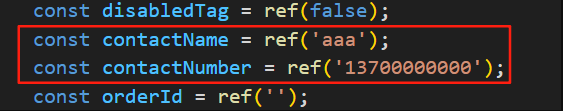
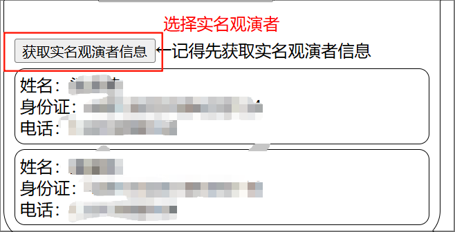
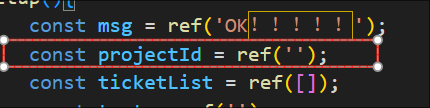

### 使用方法
***

`**本项目仅供学习使用，禁止用来抢票！！！** `

- 首先安装nodeJS，过程不表

- 安装完毕后再安装一些依赖
  `npm install --save axios` 
  `npm install --save express`
  `npm install --save cors`
  `npm install --save https (可选，想使用加密链接方式的话)`

- 打开buyTicket.js文件，在cookieValue一栏中填入自己的账号cookie
  格式SESSDATA=Value。例如SESSDATA=abchxd1111000
  `你只需要修改此栏即可，其他无需操作。`

- 启动buyTicket.js文件
  `node buyTicket.js`

- 使用Live Server打开或者直接打开index.html文件

- 你可以在index.html里预填观演者信息（联系人和联系电话）
  `请务必保证联系电话格式正确，本文件不做校验`
  

- 点击按钮获取实名观演者信息
  `如果你在buyTicket.js里填入的cookieValue正确且有效，则会在按钮下方展示实名观演者信息`
  

- 输入展览Id并查询
  `你也可以在index.html文件里预填展览Id，以免每次打开都要输入一遍展览Id`
    

- 选择票档并确认信息

`后续内容待补充`

### 目前已知缺陷
***
  - 没有验证码过码能力，因此不具备在热门的展览上准点抢票的能力。
  - 没有对预下单token过期后进一步处理。
  - 定时执行的脚本没有自动化下单的能力，即准点后只执行预下单的请求。
  - 没有对开售时间前进行预下单的行为进行阻止。
  - 代码健壮性不足，对错误处理不足。
  - 没有对轮询下单的速率进行限制。
  - （目前就想到这么多